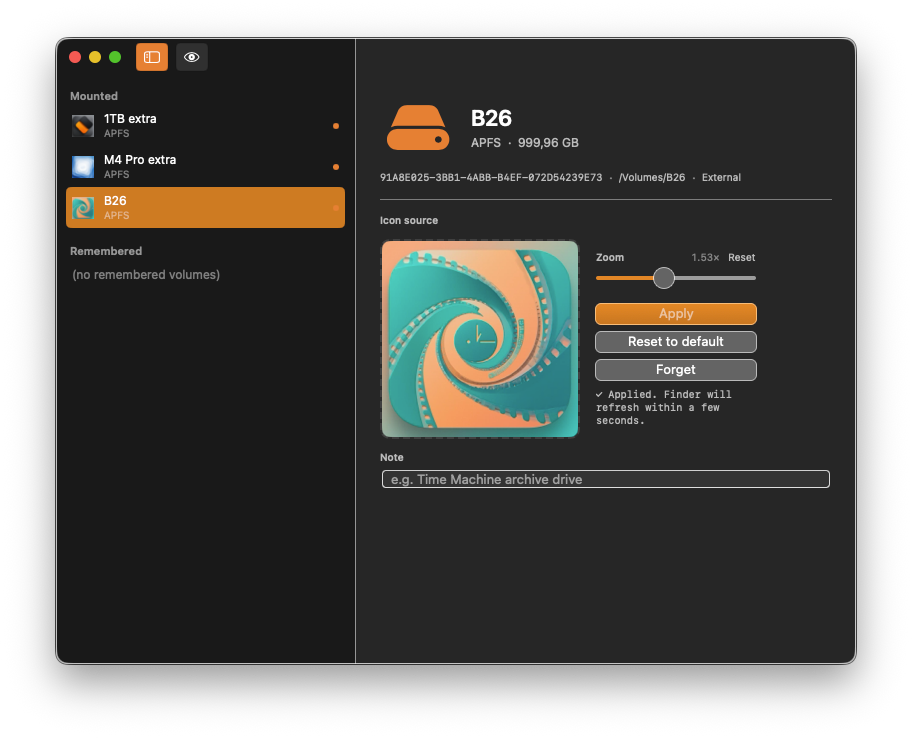
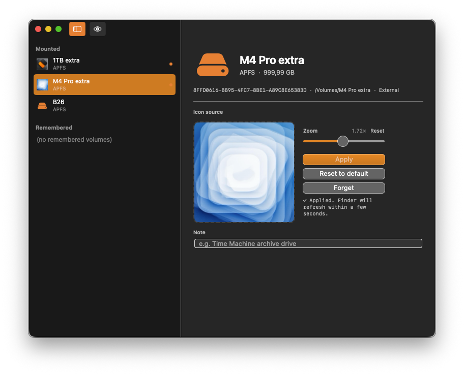
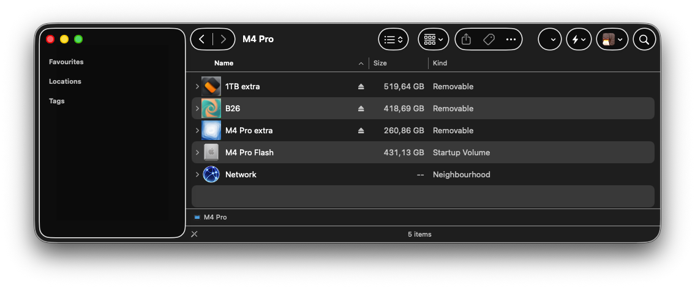
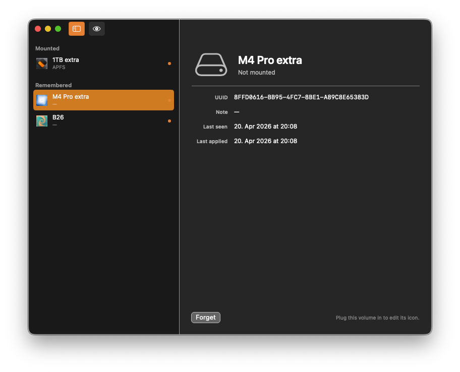

#  Sigil

A macOS app that assigns custom icons to external volumes — and **remembers them across unmounts, reformats, and remounts**.


[](https://github.com/Xpycode/Sigil/releases/latest)


## Screenshots


*Main window — sidebar lists mounted and remembered volumes, detail pane holds the drop zone, zoom, and actions*


*Applied state — current icon fills the canvas at the chosen zoom, ready to adjust or reset*


*Finder — custom icons persist on the volume, visible anywhere macOS shows drive icons*


*Remembered group — unmounted drives keep their assignment for silent re-apply on remount*

## Features

- **Apply** custom icons from PNG, JPEG, HEIC, or `.icns` files via drag-and-drop or click-to-browse
- **Remember** every assignment in a local database keyed by volume UUID
- **Silent re-apply** — plug a known drive back in and Sigil writes its icon back within 1–3 seconds, no clicks required
- **Zoom** — dial in framing for non-square source images (1.0× fits, higher values fill)
- **Conflict detection** — if the volume's icon changed outside Sigil, Sigil asks rather than clobbering
- **Per-volume notes** — tag what each drive is for; notes show in the Remembered group even when unplugged
- **Reset** — one click returns a volume to its default Finder icon
- **Forget** — one click removes Sigil's record of a volume entirely

## Why Sigil exists

macOS Finder stores a custom volume icon as a hidden `.VolumeIcon.icns` file on the volume itself. Reformat the drive and the icon's gone. Use it on another Mac and the icon's gone. Plug in a new drive and you get the generic silver icon forever. Sigil fixes all three by keeping the (UUID → icon) mapping locally and re-applying on remount.

## Installation

1. Download `Sigil-v1.0.0.dmg` from [Releases](https://github.com/Xpycode/Sigil/releases/latest)
2. Open the DMG and drag Sigil to Applications
3. Launch from Applications folder

The DMG is notarized by Apple — no Gatekeeper warning on first launch.

## Usage

1. **Plug in** an external volume
2. **Select it** in the Mounted sidebar
3. **Drop or click** an image onto the canvas
4. **Zoom** the preview if needed (raster sources only; `.icns` is already sized)
5. **Apply** — the Finder icon updates within a second

Once applied, the assignment is remembered. Eject and replug the drive anytime — Sigil re-applies silently.

### Keyboard Shortcuts

| Shortcut | Action |
|----------|--------|
| ⌘S | Apply |
| ⌘W | Close window |
| ⌘Q | Quit |

## How it works

Every apply is a direct three-step write to the volume root:

1. Write the rendered `.icns` to `/Volumes/<Drive>/.VolumeIcon.icns` atomically
2. Set byte 8 of `com.apple.FinderInfo` to `0x04` (the `kHasCustomIcon` flag) via `setxattr(2)`
3. Bump the volume's mtime with `utimes` so Finder refreshes its icon cache

This bypasses `NSWorkspace.setIcon(_:forFile:options:)`, which [silently fails on volume roots since macOS 13.1](https://github.com/mklement0/fileicon/issues/42). The `.icns` itself is generated by `iconutil -c icns` from a 10-file `.iconset` rendered at 16/32/128/256/512pt @1x and @2x.

## Data

Sigil stores:

- `~/Library/Application Support/Sigil/volumes.json` — UUID, name, note, zoom, hash, timestamps, plus a rolling `.bak`
- `~/Library/Application Support/Sigil/icons/{uuid}.icns` — cached rendered icon for silent re-apply
- `~/Library/Application Support/Sigil/icons/{uuid}.src.{ext}` — cached source for re-rendering on zoom change

Sigil does **not** run in the background. The mount watcher only operates while the app is open. If a drive is plugged in while Sigil is closed, its icon re-applies next time you open Sigil.

## Requirements

- macOS 14.0 (Sonoma) or later
- External volumes (USB, Thunderbolt, SD, or mounted disk image)

## Building from Source

Requires Xcode 16+ and macOS 14.0+.

```bash
git clone https://github.com/Xpycode/Sigil.git
cd Sigil/01_Project
xcodebuild -scheme Sigil -configuration Release
```

## Non-goals (v1.0)

- SF Symbol / emoji icons
- iCloud sync
- Sparkle auto-update
- Mac App Store distribution
- Background process / launch at login

## Reporting bugs

Open an issue with the output of:

```bash
log show --predicate 'subsystem == "com.lucesumbrarum.sigil"' --last 1h
```

## License

[MIT](LICENSE)
